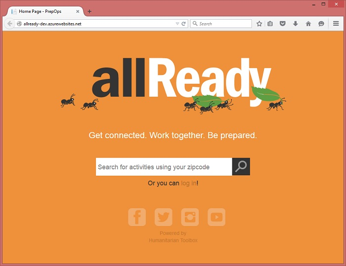
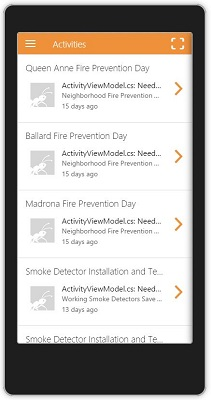

# Welcome to allReady

This repo contains the code for **allReady**, an open-source solution focused on increasing awareness, efficiency and impact of preparedness campaigns as they are delivered by humanitarian and disaster response organizations in local communities.

**Note:** As the README.md file contains contribution info currently this document is at the moment a duplicate of the README but will be updated soon with seperate and additional contribution content as we develop it.

+ [Project overview](#project-overview)
+ [How you can help](#how-you-can-help)
+ [Solution architecture](#solution-architecture)
	+ [Web application](#web-application)
	+ [Cross-platform mobile app](#cross-platform-mobile-app)
+ [Get started with the allReady solution](#get-started-with-the-allready-solution)
	+ [Prerequisites](#prerequisites)
	+ [Configure the web project](#configure-the-web-project)
	+ [Configure the mobile app project](#configure-the-mobile-app-project)
	+ [Run and test locally](#run-and-test-locally)
	+ [Deploy to Azure](#deploy-to-azure)
	

##Project overview
allReady is focused on increasing awareness, efficiency and impact of preparedness campaigns as they are delivered by humanitarian and disaster response organizations in local communities.  As preparedness and resliency of a community increases the potential for impactful disasters (both large and small) is greatly decreased.  The rule of thumb in the industry is that an hour or dollar spent before a disaster is worth 15-30 afterwards.  However preparedness activities, like ensuring working smoke detectors are in homes, are often not as visible or emotionally salient as saving children from a burning building - for example.  Theh goal of allReady - in part - is to grow awareness and engagement of communities and volunteers in preparedness campaigns to grow their impact and - aspirationally - "put disaster response out of business" through communities that are fully prepared and reslient to inevitable disasters. 

To learn more about the need for allReady, the technologies, and how the app came together, view the [project information](http://www.htbox.org/projects/allready) and [blog post](http://www.htbox.org/blog/allready-project-launched-at-visual-studio-2015-release-event) on the Humanitarian Toolbox website and watch the *[In the Code](https://channel9.msdn.com/Events/Visual-Studio/Visual-Studio-2015-Final-Release-Event/In-the-Code-App-Overview-and-Planning)* video series:

<iframe width="560" height="315" src="https://www.youtube.com/embed/XVRfcSej1l0" frameborder="0" allowfullscreen></iframe>

This project, which was jumpstarted by volunteers at Microsoft, has been turned over to [Humanitarian Toolbox](http://www.htbox.org/) so that it can be maintained and improved by the technical community at large and ultimately deployed in support of organizations delivering preparedness campaigns everywhere.

The initial launch of development for allReady started on 7/20/2015 during the [Visual Studio 2015 release event](http://aka.ms/vs2015event).

##How you can help
To help make improvements to this project, you can just clone this repository and start coding, testing, and/or designing. 

Before jumping in, please review the solution architecture and instructions below to [get started](#get-started).

As of this writing (week of 7/20/2015), we are focused on expanding and filling out our documentation, issues lists, milestones plan and supporting any issues that arise as the community first starts to engage with the codebase.  Soon in addition to the codebase you should be able to find issues of all types (simple bugs, new feature & requirements and architectural updates) upon which you can contribute to the project.  In the meantime, if you find any issues with the codebase or other content in our repository please log an issue and we will work with you to solve it.

Thank you for considering supporting this open source project for humanitarian support.

##Solution architecture

The allReady application is implemented as a Visual Studio 2015 solution that contains two projects: an ASP.NET 5 project that serves the web site and admin portal, and a cross-platform Cordova app project. The web application also exposes the REST APIs used by the mobile app to access data.

###Web Application

An [ASP.NET 5](http://www.asp.net/vnext) web application provides the front-end web experience for volunteers accessing the allReady web site and the portal used by administrators. The site is powered by ASP.NET MVC 6 using .NET 4.6 and a dependency on .NET 4.5.1. Here's the landing page for the web site: 

The web site relies on the following frameworks: 

+ [Bootstrap](http://getbootstrap.com/): responsive layouts on mobile devices
+ [Font-awesome](http://fortawesome.github.io/Font-Awesome/): scalable vector icons
+ [Hammer](http://hammerjs.github.io/): gesture support 
+ [jQuery](http://jquery.com/): ubiquitous JavaScript library
+ [Knockout](http://knockoutjs.com/): MVVM bindings 

####REST APIs

The same ASP.NET 5 project also exposes a set of Web APIs, which are part of the MVC 6 framework. These REST APIs are used by both the web site and by the Cordova mobile app. 

####Data layer

Data is stored in a database that is accessed by the ASP.NET application using Entity Framework 7. 

####Cloud services

The allReady web project is designed to be hosted in Microsoft Azure. The following services are used by this application when running in Azure:

+ [App Service Web Apps](https://azure.microsoft.com/en-us/documentation/services/app-service/web/): hosts the web application.
+ [SQL Database](https://azure.microsoft.com/en-us/documentation/services/sql-database/): storage of relational data.
+ [Storage](https://azure.microsoft.com/en-us/documentation/services/storage/): storage of uploaded BLOB data.

####Authentication

Authentication of web site mobile app users leverages OAuth 2.0 with credentials from external authentication providers, such as Facebook, Twitter, and Microsoft account. Users can use their existing social media accounts to sign into the web site or mobile app. For more information, see [Enabling authentication using external providers](http://docs.asp.net/en/latest/security/sociallogins.html). 

###Cross-platform mobile app

The mobile app project was added to the allReady solution as a [Visual Studio Tools for Apache Cordova](https://www.visualstudio.com/en-us/features/cordova-vs.aspx) project.  

The client app relies on the following frameworks: 

+ [AngularJS](https://angularjs.org/): extensible web app framework
+ [Apache Cordova](http://cordova.apache.org/): cross-platform device deployment, including these plugins:
	+ [Whitelist](https://github.com/apache/cordova-plugin-whitelist)
	+ [InAppBrowser](https://github.com/apache/cordova-plugin-inappbrowser)
	+ [BarcodeScaner](https://github.com/phonegap/phonegap-plugin-barcodescanner)
+ [Ionic](http://ionicframework.com/): enhancements for Cordova apps
+ [Moment.js](http://momentjs.com/): working with date-time values

The app accesses the [Web API](http://www.asp.net/web-api) exposed by the web app for data access.

Users can sign-in with supported social providers: Facebook, Twitter, and Microsoft account. You must configure each of these providers for the mobile app separately, as described in the next section.

##Get started with the allReady solution

This section will help you get up-and-running with the allReady solution.

###Prerequisites 

You will need the following to be able to run the allReady solution locally:

+ Visual Studio 2015, including the tools for Apache Cordova, and optionally the emulator for Android apps. [link to download at release event site](http://aka.ms/vs2015event).

You will need the following to be able to run the allReady solution in Azure:
+ An active Microsoft Azure account to deploy the web app. You can sign-up for a free trial of Azure [here](https://azure.microsoft.com/en-us/pricing/free-trial/).

###Configure the web project

The PrepOps project relies on configuration settings at runtime, such as whether to use a local database or a Azure SQL Database for data storage, whether to load sample data, default accounts information, and credentials for connecting to other services. These setting values can be stored in the project's config.json file. However, doing this makes it easier to accidentally expose secrets. ASP.NET 5 includes a secrets manager tool, and you should instead use this to locally store settings in your user account. When you publish the project to Azure Web Apps, you will need to set these same values as app settings in your web app.

**Note:** currently the codebase includes no values for any 'secret' values in configuration.  As we deploy a dev and live site for this via HTBox we will configure 'production' values for testing and production.  We are also working on how to best support open development with the identity providers below for all contributors and will update this information when a full solution is found.

Configuration settings are accessed at startup using the **Configuration** property, which implements **Microsoft.Framework.Configuration.IConfiguration**. The following example gets the value of the **InsertSampleData** field that is a child of the **Data** node:

	Configuration["Data:InsertSampleData"]

These topics show you how to use the secrets manager for app settings when running locally and how to add app settings in your web app in the Azure portal: 

+ [Safe Storage of Application Secrets](http://docs.asp.net/en/latest/security/app-secrets.html) 
+ [Enabling authentication using external providers](http://docs.asp.net/en/latest/security/sociallogins.html#use-secretmanager-to-store-facebook-appid-and-appsecret)
+ [Configure web apps in Azure App Service](https://azure.microsoft.com/en-us/documentation/articles/web-sites-configure/#application-settings)

The following app settings are used by the project.   

####Data settings

These settings control how the web app stores and seeds data:

| **Key value**                                  | **Description**                                          |
|------------------------------------------------|----------------------------------------------------------|
| `Data:DefaultConnection:UseInMemory`           | Determines whether an in-memory data store or a persisted database is used to store data |
| **`Data:DefaultConnection:AzureConnectionString`** | The Azure SQL Database connection string. For more information, see [How to use Azure SQL Database in .NET applications](https://azure.microsoft.com/en-us/documentation/articles/sql-database-dotnet-how-to-use/). |
| `Data:DefaultConnection:LocalConnectionString` | The local DB connection string. This setting is required to run the app locally, unless you set **Data:DefaultConnection:UseInMemory** to `true`. |
| `Data:InsertSampleData`                        | When `true`, seed data is loaded into the data store.    |
| `Data:InsertTestUsers`                         | When `true`, test user accounts are created on start-up. |
| **`Data:Storage:AzureStorage`**                | The Azure Storage service connection string.             |

Settings in **bold** should be stored in the secrets manager.

####Authentication settings

These settings are the credentials for the app registrations of the social media platforms supported for authentication:

| **Key value**                                  | **Description**                                          |
|------------------------------------------------|----------------------------------------------------------|
| `Authentication:Facebook:AppId`                | The ID of the Facebook app registration. For more information, see [Register your apps for Facebook](https://azure.microsoft.com/en-us/documentation/articles/mobile-services-how-to-register-facebook-authentication/) |
| `Authentication:Facebook:AppSecret`            | The shared secret for the Facebook registration.         |
| `Authentication:Twitter:ConsumerKey`           | The consumer key of the Twitter app registration. For more information, see [Register your apps for Twitter](https://azure.microsoft.com/en-us/documentation/articles/mobile-services-how-to-register-twitter-authentication/) |
| `Authentication:Twitter:ConsumerSecret`        | The shared secret for the Twitter consumer key.          |
| `Authentication:MicrosoftAccount:ClientId`     | The client ID of the Microsoft account app registration. For more information, see [Register your apps for Microsoft account](https://azure.microsoft.com/en-us/documentation/articles/mobile-services-how-to-register-microsoft-authentication/) |
| `Authentication:MicrosoftAccount:ClientSecret` | The shared secret of the Microsoft account registration. |

All of these settings should be stored in the secrets manager.

####Connected service settings

The following settings enable the web app to connect to other services:

| **Key value**                                  | **Description**                                          |
|------------------------------------------------|----------------------------------------------------------|
| `ApplicationInsights:InstrumentationKey`       | The instrumentation key used by Application Insights.    | 
| `Authentication:Twilio:Sid`	                 | The ID the Twilio account to use for voice or SMS. For more information, see [How to use Twilio for voice and SMS capabilities from Azure](https://azure.microsoft.com/en-us/documentation/articles/twilio-dotnet-how-to-use-for-voice-sms/)|
| `Authentication:Twilio:Token`                  | The authentication token for the [Twilio](https://www.twilio.com/) account used to send email. |
| `Authentication:Twilio:PhoneNo`                | The phone number to display in a Twilio voice or SMS.    |
| `Authentication:SendGrid:UserName`             | The username of the [SendGrid](https://sendgrid.com/) account used to send email.|
| `Authentication:SendGrid:Password`             | The password of the Microsoft account app registration. |
| `Authentication:MicrosoftAccount:ClientSecret` | The shared secret of the Microsoft account registration. |

All of these settings should be stored in the secrets manager.

###Configure the mobile app project

The URL of the PrepOps web site is set in the **domainUrl** variable in the /www/app/services.js file.

###Run and test locally

Once you have set the required settings either in the config.json file or in the secrets manager, you can run and locally debug the projects. If you have not yet created a SQL Database in Azure, you should use either the in-memory data storage option or use `Data:DefaultConnection:LocalConnectionString` as the **connectionStringPath** value in Startup.cs.

###Deploy to Azure

The PrepOps project is designed to run hosted in Azure. The following sections describes the steps needed to get PrepOps web app running in Azure as you develop. Note that App Service Mobile Apps is currently available in the [Azure Preview Portal](https://portal.azure.com/).

**Note:** Again as with config, we will be hosting test and production instances of the application in the near future for tester contributors looking for instances of the application to test against and for others to reference.  The instructions here are for self hosting in your own trial instance if you choose during development.  However our goal is for all development to be able to be performed locally with alternatives or emulators for the online pieces.

####Create an Azure Web app

To be able to publish the PrepOps project to Azure, you must first create a new web app in an Azure App Service environment. To learn how to do this, see [How to Create a Web App in an App Service Environment](https://azure.microsoft.com/en-us/documentation/articles/app-service-web-how-to-create-a-web-app-in-an-ase/).

Once you have created your web app, you must create the required app settings. To run the site, you must create a connection string setting for `Data:DefaultConnection:AzureConnectionString`. To learn how to do this, see [Configure web apps in Azure App Service](https://azure.microsoft.com/en-us/documentation/articles/web-sites-configure/#application-settings).

####Create SQL Database

The next step is to create a new Azure SQL Database. To learn how to do this, see [Create your first Azure SQL Database](https://azure.microsoft.com/en-us/documentation/articles/sql-database-get-started/). Once you have created your database in Azure, make sure that `Data:DefaultConnection:UseInMemory` is set to false (or not set at all) and that `Data:DefaultConnection:AzureConnectionString` is set as the **connectionStringPath** value in Startup.cs. 

Note that you can use this connection even when running on a local machine, as long as you have created a firewall exception for your local computer. For more information, see [Step 5: Configure the firewall](https://azure.microsoft.com/en-us/documentation/articles/sql-database-get-started/#step-5-configure-the-firewall).

####Publish to Azure

Once you have your web app configured, you can publish the project to Azure. For more information, see [Deploy a web app in Azure App Service](https://azure.microsoft.com/en-us/documentation/articles/web-sites-deploy/).
