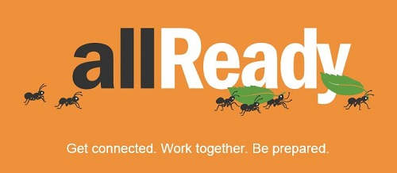

# Welcome to allReady

This repo contains the code for **allReady**, an open-source solution focused on increasing awareness, efficiency and impact of preparedness campaigns as they are delivered by humanitarian and disaster response organizations in local communities.

**Note:** As the README.md file contains contribution info currently this document is at the moment a duplicate of the README but will be updated soon with seperate and additional contribution content as we develop it.

+ [Project overview](#project-overview)
+ [How you can help](#how-you-can-help)
+ [Solution architecture](#solution-architecture)	

## Project overview
allReady is focused on increasing awareness, efficiency and impact of preparedness campaigns delivered by humanitarian and disaster response organizations in local communities.  As community preparedness and resliency increases, the potential for impactful disasters (both large and small) is greatly decreased.  Though not as visible or emotionally salient as saving children from a burning building, preparedness activities like ensuring working smoke detectors in a community, follows the industry rule of thumb where an hour or dollar spent before a disaster is worth 15-30 afterwards.  The goal of allReady hinges on growing awareness of, and engaging communities and their volunteers in preparedness campaigns, and more aspirationally, to "put disaster response out of business" by preparing communities to be reslient to inevitable disasters. 

To learn more about the need for allReady, the technologies involved and how the app came together, view the [project information](http://www.htbox.org/projects/allready) and [blog post](http://www.htbox.org/blog/allready-project-launched-at-visual-studio-2015-release-event) on the Humanitarian Toolbox website and watch the *[In the Code](https://channel9.msdn.com/Events/Visual-Studio/Visual-Studio-2015-Final-Release-Event/In-the-Code-App-Overview-and-Planning)* video series:

<iframe width="560" height="315" src="https://www.youtube.com/embed/XVRfcSej1l0" frameborder="0" allowfullscreen></iframe>

The allReady project was jumpstarted by volunteers at Microsoft and has been turned over to [Humanitarian Toolbox](http://www.htbox.org/) to be maintained and improved by the technical community at large and ultimately deployed in support of organizations delivering preparedness campaigns everywhere.

The initial launch of development for allReady started on 7/20/2015 during the [Visual Studio 2015 release event](http://aka.ms/vs2015event).

## How you can help
To help make improvements to this project, you can just clone this repository and start coding, testing, and/or designing. 

Before jumping in, please review the solution architecture and instructions below to [get started](#solution-architecture).

As of this writing (week of 7/20/2015), we are focused on expanding and filling out our documentation, issues lists, milestones plan and supporting any issues that arise from community engagement with the codebase.  Additionally, you willl find issues of all types (simple bugs, new feature & requirements and architectural updates) upon which you can contribute to the project.  In the meantime, if you find any issues with the codebase or other content in our repository please log an issue and we will work with you to solve it.

Thank you for considering supporting this open source project for humanitarian support.

## Solution architecture

See the [Solution Architecture Guide](https://github.com/HTBox/allReady/wiki/Solution-architecture) for all of the details on how allReady is built.
