# Git Usage for allReady

>This guide assumes that you have already installed all of the required software for the allReady project and only covers usage of Git.

<!-- START doctoc generated TOC please keep comment here to allow auto update -->
<!-- DON'T EDIT THIS SECTION, INSTEAD RE-RUN doctoc TO UPDATE -->
**Table of Contents**

- [Installing Git](#installing-git)
- [Configuring Git](#configuring-git)
- [Forking the Repository](#forking-the-repository)
- [Cloning the Repository](#cloning-the-repository)
- [Setup a link to the HTBox/allReady repository](#setup-a-link-to-the-htboxallready-repository)
- [Creating a branch](#creating-a-branch)
- [Committing Changes Locally](#committing-changes-locally)
- [Sending Changes to Github](#sending-changes-to-github)
- [Creating a Pull Request](#creating-a-pull-request)
- [Making changes to an existing pull request](#making-changes-to-an-existing-pull-request)
- [Thank you](#thank-you)

<!-- END doctoc generated TOC please keep comment here to allow auto update -->

## Installing Git

In order to contribute to allReady, you need to make sure to have a Git client installed.  This guide use the Git command line.  

The instructions for installing the Git command line are available at [https://git-scm.com/book/en/v2/Getting-Started-Installing-Git](https://git-scm.com/book/en/v2/Getting-Started-Installing-Git)

## Configuring Git

There is a little bit of configuration that you need to do git in order for git to work correctly.

>**Note:** the --global is used in the command below to set the default configuration for all repositories.  If it is left off, you need to first clone the repository and then run the command in the allReady folder to save it as just a project configuration.

**User Name to Associate to Changes**  

```
git config --global user.name "Your Name"
```

**Email Address Associated to Github Account**

```
git config --global user.email "youremail@domain.com"
```

**Setup Long Paths (Windows Only)**

```
git config --global --add core.longpaths true
```

**Proxy Servers**

If you are behind a proxy server, you may also need to add the following configurations.

```
git config --global --add [Your Proxy Server and Port]

git config --global --add https.proxy [Your Proxy Server and Port]

```

Not always is the git protocol allowed through firewalls.  If you encounter issue with not being able to interact with remote repository you can tell git to always use the https protocol instead.

```
git config --global --add url.https://github.com.insteadof git://github.com
```

## Forking the Repository

In order to make changes the first thing you need to do is create a copy of the repository into your account.  In Git terms, this is called forking the repository.

The reason that you need to fork the repository is because you do not have write access to the HTBox allReady repository.  When you fork the repository into your account, you have full write access to it to make changes and then you can send them back to the HTBox allReady repository by submitting a pull request.

**Steps to Fork the Repository:**  

1. Navigate to [https://github.com/HTBox/allReady](https://github.com/HTBox/allReady)
1. Click on the Fork button

    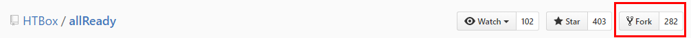

1. After the fork has been made, you will be redirect over to the fork.  Your repository will be https://github.com/[User Name]/allReady

You are now ready to download the repository onto your machine by cloning it.

## Cloning the Repository

Cloning the repository is how you get the repository from Github onto your local machine and keep the link to Github to be able to interact with the repository local.

You will want to make sure to do a clone and not download the zip file version of the repository if you want to be able to interact with the source code on your machine as a Git repository.

**Steps to Clone:**

1. Navigate to your forked copy of the repository.
1. Click on the "Clone or download" button
1. In the popup that comes up, click on the Clipboard looking button next to the url.

    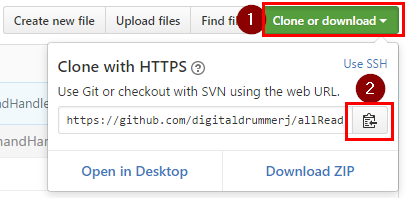

1. Next you need to open up a terminal / command prompt
1. In the command prompt, navigate to where you want to store your source code at.  
1. Then run the following command to create an allReady directory and download the repository onto your machine.  Make sure to replace "[Your UserName]" with your actual Github user name.

        git clone http://github.com/[Your UserName]/allReady

You now have the repository on your machine.  Next we need to install all of the npm and bower dependencies for the web application and mobile app.

### Install Web App Dependencies

1. cd into the allReady/AllReadyApp/Web-App directory
1. For the npm dependencies you need to run

        npm install

1. For the bower dependencies you need to run 

        bower install

    * If you get a message that bower is not a recognized command, it means that you have not installed bower yet.  You can install bower by running `npm install -g bower`

If you are not going to be working on the allReady mobile application you are now ready to open up the allReady solution in Visual Studio and make sure that it compiles.  In the allReady\AllReadyApp directory is the AllReadyWebonly.sln file that will open just the web project files and does not include the mobile application.  Open up this file and compile the project in Visual Studio.  This will take a few minutes the first time as it pulls down all of the nuget packages that are referenced.

If you are going to be working on the mobile application as well as the web application, go through the "Mobile App dependencies" section.

Once the solution compiles successfully you are ready to start contributing.

### Install Mobile App Dependencies

1. cd into the allReady/AllReadyApp/Web-App/AllReady directory
1. For the npm dependencies you need to run

        npm install

1. For the bower dependencies you need to run

        bower install

    * If you get a message that bower is not a recognized command, it means that you have not installed bower yet.  You can install bower by running `npm install -g bower`.  You will need to reopen your command prompt after install and navigate back to the  allReady/AllReadyApp/Web-App/AllReady directory.
1. Before installing the ionic and cordova dependencies you need to run and answer the "send anonymous usage" question.

        cordova -v
        
    * If you get a message that cordova is not a recognized command, it means that you do not have cordova installed yet.  You can install cordova by running `npm install -g cordova` . You will need to reopen your command prompt after install and navigate back to the  allReady/AllReadyApp/Web-App/AllReady directory.
1. Now we need to restore all of the cordova platforms and plugins that are configured by running:

        ionic state restore
     
    * If you get a message that ionic is not a recognized command, it means that you do not have ionic installed yet.  You can install ionic by running `npm install -g ionic` . You will need to reopen your command prompt after install and navigate back to the  allReady/AllReadyApp/Web-App/AllReady directory.

You are now ready to open up the solution in Visual Studio.  In the allReady\AllReadyApp directory is the AllReadyApp.sln file that will open up all of the projects.  Open up this file and compile the project in Visual Studio.  Compiling the first time will take several minutes as all of the nuget packages and cordova references are download.

Once the solution compiles successfully you are ready to start contributing.


## Setup a link to the HTBox/allReady repository

Before making changes to your repository, you will want to setup a reference back to the HTBox allReady repository so that you can pull changes into your forked repository.

1. Open the command prompt and navigate to the allReady directory.
1. Run the following command to setup a reference called upstream to the HTBox/allReady repository.

        git remote add upstream https://github.com/HTBox/allReady.git

1. Verify that it was setup successfully by running 

        git remote -v         
        
    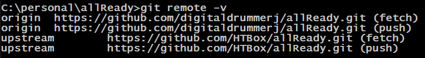

You are now ready to create a branch and start contributing.


## Creating a branch

You want to keep your master branch in sync with HTBox and not be making changes on the master branch.  Instead you will want to create a branch for each issue that you are working on so that each issue fix is isolated for other issues that you are working on.  

The first step before creating a branch is to find the issue that you are going to work on.  You can find all of the open issues at [https://github.com/HTBox/allReady/issues](https://github.com/HTBox/allReady/issues).  

Once you find the issue that you want to work on, make sure to view the issue details page and review list of comments for the issue to ensure that someone else has not already signed up to work on the issue.  If no one has signed up to work on the issue then add a comment to the issue stating that you are going to work on it.  This allows both the maintainers of HTBox as well as other contributors to know that someone is working on this issue so that they do not also work on it.      

To add a comment to an issue, click on the issue to go to the details page for the issue.  In the text box at the bottom of the page add a "I can take this one" comment and click the comment button.

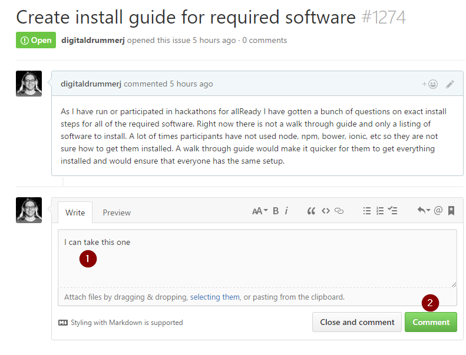

Once you click the Comment button your comment will be added to the list of comments on the issue.  

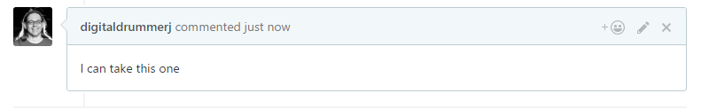

Now that you have signed up for the issue on Github, you need to create a branch.  

**Steps to Create the Branch**

The first thing we are going to do is make sure that your forked repository is in sync with the HTBox/allReady repository using the upstream link you setup in the previous section.

1. Open a command prompt and navigate to the allReady folder.
1. Make sure we are on the master branch by running:

        git checkout master

1. To download all of the changes from HTBox/allReady but not merge them run:

        git fetch upstream

1. To merge the upstream changes into your local master branch run:

        git merge upstream/master

1. To send the synced changes from your local repository to Github run:

        git push
        
1. Create and checkout our issue branch. **Replace "####" with the Github issue number.**  

        git checkout -b issue-branch-###        

You are now ready to code away.

>**Note:** If bower.json or package.json files have been changed, you will need to run the `npm install` and `bower install` commands like you did as part of the cloning section.


## Committing Changes Locally

Before you can commit changes to your repository, you need to add them into your repository.  

**See Changes To Be Made**

To see the list of files and directories that have been added, changed or deleted run that have both been staged and not staged run:

```
git status
```  

### Adding Changes

To add the changes, you can either go file by file or add all of them at once.  

**File By File**

```
git add [file name]
```

**Add All Changes**

```
git add .
```

### Backout Changes

**Staged File**

To check if a file has been staged, run `git status` and look at the "Changes to be committed:" section.

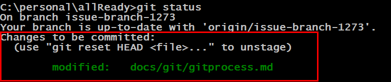


If your file has already been added (staged) for commit, you unstage the file first: 


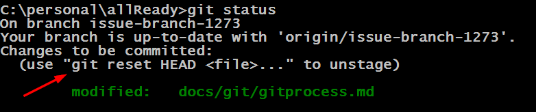

```
git reset HEAD [file name]
```

Once you run git reset, it will put the file back into an unstaged status.

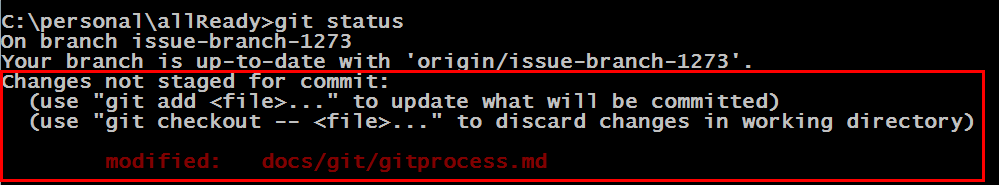

If you want to remove any changes that you have made to the file, follow the **unstaged file** section below.

**Unstaged File**

To check if a file has been changed but not staged for commit, run `git status` and look at the "Changes not staged for commit:" section.

```
git status
```


To remove any changes from the file run 

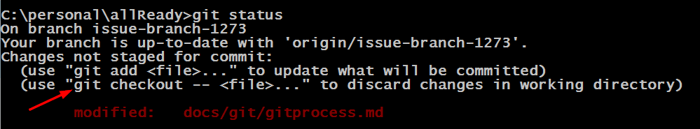

```
git checkout [file name]
``` 


If you run a `git status` again you will see that the file is not longer in a changed state.


### Committing Changes

Before committing the changes to the repository, it is suggested to run `git status` one more time to make sure that all of the changes that you are expecting to be made is actually what will be made.

Once you are happy with changes that will be made, you need to commit them to the repository by running:

```
git commit
```

> **Note:** When you run git commit without any command line arguments, it will open up a vi editor for you to add a commit message.  In the editor, the 1st line is the < 50 character subject and the 2nd line to the end is the long description of the changes.  

**Commit Message Editor Instructions**

1. To enter edit mode, press **i** on the keyboard.
1. Add your subject and long description
1. When done editing the commit message, press the **esc** key to exit edit mode
1. Press the semi-colon to enter into command mode
1. Enter wq to write the commit message, quit the editor and commit the change to your repository.  

**Cancel Commit**

If you make a mistake in your commit message and want to cancel your commit,  press the **esc** key to exit edit mode, press the semi-colon to enter into command mode, and enter q! to exit without saving the commit.

## Sending Changes to Github

Since Git is a distributed version control system, the committed changes are only stored locally until you push them to the remote repository which in this case will be Github.  When you push changes to Github, you are pushing them only to your forked repository and the HTBox/allReady repository will not be affected by your changes.


Before pushing your changes up to Github, you should sync the changes from the HTBox/allReady repository into your repository and re-test.  **Replace "####" in the branch name with your Github issue number.**

```
git checkout master
git fetch upstream
git merge upstream/master
git checkout issue-branch-####
git rebase master
```

Re-run the unit test.  If they pass successfully, then you are ready to push the changes to Github.

The first time that you push the branch to Github you need to set the upstream so that Git knows how to submit any changes that you make later to the branch. **Replace "####" in the branch name with your Github issue number.**

```
git push --set-upstream origin issue-branch-#### 
```

If you need to later on make changes to the branch and have not done a rebase and are on the branch, run

```
git push
``` 

After your initial push, if made changes and did a rebase again, you need to run the following command.  **Replace "####" in the branch name with your Github issue number.**

```
git push origin issue-branch-#### -f
```


## Creating a Pull Request

Once you are done fixing the Github issue that you are working on and are ready to submit your changes to the HTBox allReady team, you need to create a Pull Request on the Github website.  Unfortunately this is no command line option to create a pull request.

To create your pull request, navigate to your allReady repository on the Github website.  When you are on the allReady repository and viewing your issue branch, you will see a "Compare & pull request" button displayed.  Click on this button to start your pull request. 

> **Note:** If for some reason that button is not visible, click the Pull Request link on your branch.

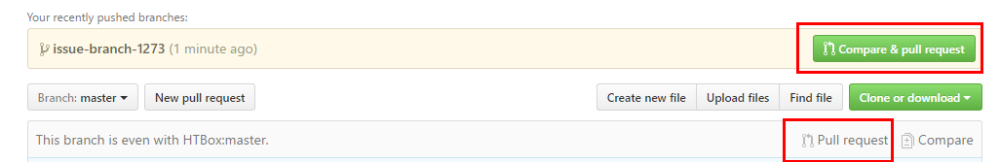

On the Pull Request page, you can scroll down to review the changes you are submitting. 

For some projects, you will also see a link to guidelines for contributing. 

Be descriptive in the subject and description for your pull request. Provide information on the changes you made so the project owners know exactly what you were trying to accomplish. 

If there is an issue(s) you are addressing with this pull request make sure you reference it by number (e.g. #124) in the description of your pull request.  If the Pull Request fixes the Github issue, make sure to add the following text to the description to close the issue when the Pull Request is merged.  Make sure to replace 1234 with your Github issue number:

```
Closes #1234
```

Click the Preview tab to make sure that the description looks correct and that the links to the issues are correct.  If everything looks good, click the Create Pull Request button.

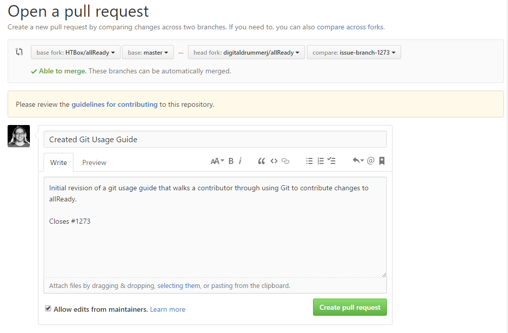

Your pull request has now been created and is ready for the project owners to review (and hopefully accept).  allReady has an AppVeyor build that compiles the application and runs unit tests. You should monitor this and ensure that all the checks pass.

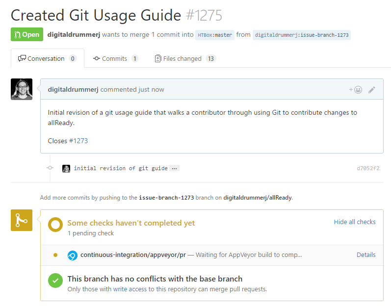

If all goes as planned, your pull request will be accepted. Of course, things don’t always go as planned. Let’s explore how to handle having to make changes to your Pull Request.

## Making changes to an existing pull request

Often, the project owners will make comments on your pull request and ask you to make some changes. Don’t feel bad if this happens, it happens especially with large pull request.  When this happens, don’t close the pull request. Simply make your changes locally, commit them to your local branch, then push those changes to GitHub.  Github will automatically pick up any changes that are pushed to your issue branch on Github and add them into the Pull Request. 


## Thank you

Thank you for contributing to the allReady project.  Keep the changes coming.  When you are ready to work on another issues, start at the     

At this point, you are ready to work on more Github issues.  This time you can start at the "Creating a branch" section.