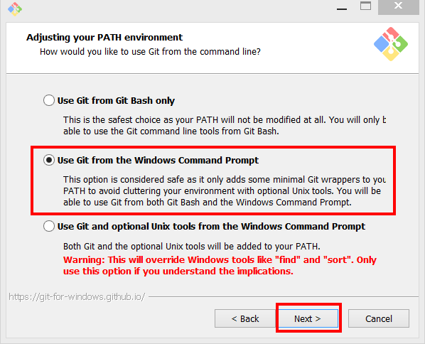
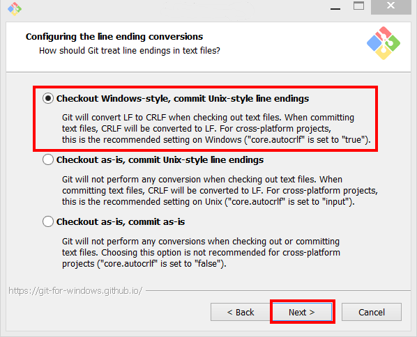
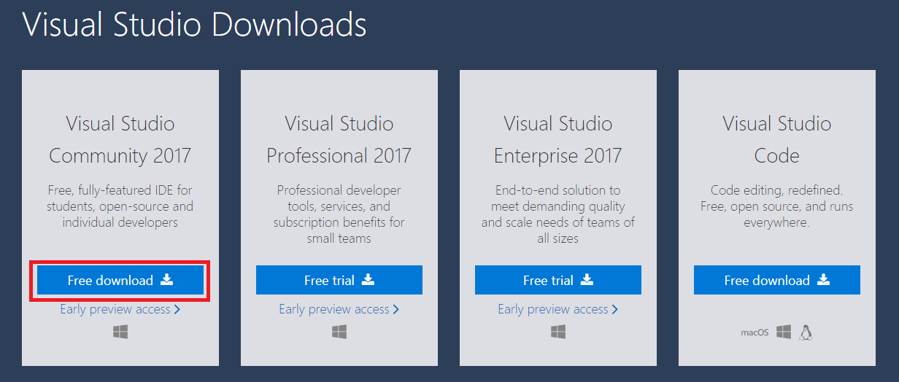
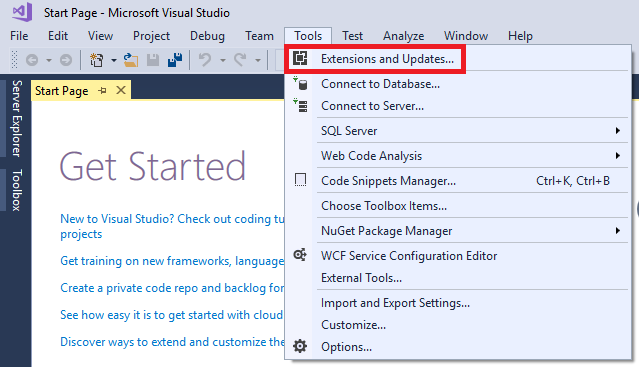
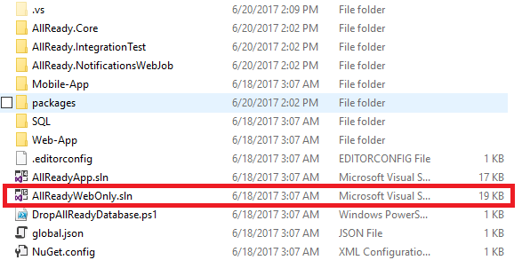
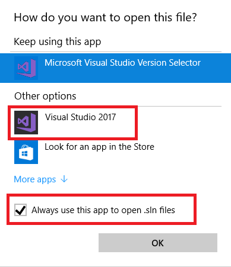

# Prerequisite Install Guide

This guide will walk you through all of the software that needs to be installed and configured in order to contribute to the allReady project.

<!-- START doctoc generated TOC please keep comment here to allow auto update -->
<!-- DON'T EDIT THIS SECTION, INSTEAD RE-RUN doctoc TO UPDATE -->
**Table Of Contents**

- [General Install Steps](#general-install-steps)
  - [Windows Showing File Extensions](#windows-showing-file-extensions)
  - [Git](#git)
  - [Configuring Git](#configuring-git)
  - [Node.js](#nodejs)
  - [Proxy Settings](#proxy-settings)
    - [Windows Proxy](#windows-proxy)
    - [NPM](#npm)
  - [Updating to Npm 3](#updating-to-npm-3)
  - [Bower](#bower)
  - [Gulp](#gulp)
  - [Visual Studio](#visual-studio)
  - [Configure Visual Studio External Web Tools](#configure-visual-studio-external-web-tools)
  - [Installing Microsoft ASP.NET and Web Tools](#installing-microsoft-aspnet-and-web-tools)
- [Web Solution](#web-solution)
  - [Compiling Web Solution](#compiling-web-solution)
  - [Running Web Solution](#running-web-solution)
- [Mobile Solution](#mobile-solution)
  - [Installing Mobile Tools](#installing-mobile-tools)
  - [Compiling Mobile Solution](#compiling-mobile-solution)
  - [Running in Web Browser](#running-in-web-browser)
  - [Deploying to Android Mobile Device](#deploying-to-android-mobile-device)
- [Running Test Cases](#running-test-cases)

<!-- END doctoc generated TOC please keep comment here to allow auto update -->

## General Install Steps

### Windows Showing File Extensions

By default Windows is set to not show file extensions for known files which causes files such as .gitconfig and .npmrc to show up as just a period with no file extension.  To fix this we need to turn set Windows Explorer to show file extensions.

1. Open Windows Explorer
1. Click on the View Tab and select Options

    

Once the "Folder Options" dialog is open: 

1. Click on the View Tab
1. Uncheck the "Hide extensions for known file types"
1. Click Ok

    

### Git

1. Download the latest version of [Git](http://git-scm.com/download).
1. Run the installer. 
1. Click Next 

    

1. Check all except for the last checkbox and click Next

    

1. Select the "Use Git from the Windows Command Prompt" and click Next

    

1. Select the "Checkout Windows-style, commit Unix-style line endings" and Click Next

    

1. Select the "Use MinTTY (the default terminal of MSYS2)    

    

1. Check "Enable File system caching" and "Enable Git Credential Manager" then click Install

    

1. After the install has completed run `git --version` in a command propt or command prompt to verify your install.

The last item we need to do is to setup your Git profile. In the command prompt execute the following sets of commands. 


### Configuring Git

There is a little bit of configuration that you need to do git in order for git to work correctly.

>**Note:** the --global is used in the command below to set the default configuration for all repositories.  If it is left off, you need to first clone the repository and then run the command in the allReady folder to save it as just a project configuration.

**User Name to Associate to Changes**  

```
git config --global user.name "Your Name"
```

**Email Address Associated to Github Account**

```
git config --global user.email "youremail@domain.com"
```

**Setup Long Paths (Windows Only)**

```
git config --global --add core.longpaths true
```

**Proxy Servers**

If you are behind a proxy server, you may also need to add the following configurations.

```
git config --global --add http.proxy [Your Proxy Server and Port]

git config --global --add https.proxy [Your Proxy Server and Port]

```

Not always is the git protocol allowed through firewalls.  If you encounter issue with not being able to interact with remote repository you can tell git to always use the https protocol instead.

```
git config --global --add url.https://github.com.insteadof git://github.com
```


You can validate that your configurations were saved by running:

```bash
git config --global --list
```

Your output should look similar to:

```bash
credential.helper=manager
url.https://github.com.insteadof=git://github.com
user.email=youremail@domain.com
user.name=Your Name
core.longpaths=true
https.proxy=[Your Proxy Server and Port]
http.proxy=[Your Proxy Server and Port]
```

Behind the scenes these will commands created entries in the .gitconfig file that is located in
your user profile directory.  On Windows this would be c:\users\[your idsid]. 

 The file will look similar to:

```text
[credential]
	    helper = manager
[url "https://github.com"]
	    insteadof = git://github.com
[user]
	    email = youremail@domain.com
	    name = Your Name
[core]
	    longpaths = true
[https]
	    proxy = [Your Proxy Server and Port]
[http]
	    proxy = [Your Proxy Server and Port]
```

### Node.js

1.	Download the latest stable version (LTS) of [NodeJS](https://nodejs.org/en/download/) which as of this writing is 4.6.0.

    

1.	Once you download the installer, run it and accept all defaults.
1.	When the install is completed, launch a command prompt and execute `node -v` to validate the version installed.  It should return 4.6.0 as of this writing.

### Proxy Settings

Command line shells do not use global proxy setting so these need to be set in several files. All the files to be edited or created reside in the c:\users\\[your idsid] directory.

#### Windows Proxy 

If you are on a Windows system and will use the Command window to execute Node or Bower commands you need to set your proxies at the user level.

1. In an Windows Command prompt execute the following commands to configure proxies:

```js
setx http_proxy [Your Proxy Server and Port]

setx https_proxy [Your Proxy Server and Port]
```

#### NPM

1.	In a command prompt execute the following commands to configure Node:

```js
npm config set proxy [Your Proxy Server and Port]

npm config set https-proxy [Your Proxy Server and Port]
```

### Updating to Npm 3

For Windows users, it is suggested that you install npm 3.x to avoid issues with file path lengths.  Npm 3.x is works much better on Windows than the 2.x version that comes with Node 4.x.  To upgrade Npm to the 3.x version, we are going to use the Npm package, [npm-windows-upgrade](https://www.npmjs.com/package/npm-windows-upgrade).

First, ensure that you can execute powershell scripts on your system by running the following command from an **elevated PowerShell** by clicking Start, search for PowerShell, right-click PowerShell and select Run as Administrator.

```powershell
Set-ExecutionPolicy Unrestricted -Scope CurrentUser -Force
```

Then, to install and use this upgrader tool, from an an elevated PowerShell or command prompt run: 

```bash
npm install --global --production npm-windows-upgrade
npm-windows-upgrade
```

The tool will show you a list of all the published and available versions of npm (including pre-release and beta versions). Choose the latest 3.x version that shows up, which as of writing this is 3.10.8

To validate that it installed correctly, from your Powershell or command prompt run:

```bash
npm -v
```

You are now done with the elevated Powershell and/or command prompt and can close it.  

### Bower

Open a non-administrative command prompt and execute the command:

```
npm install -g bower
```

To verify that bower was installed, run the command `bower -v`.  As of this writing the version returned was 1.7.9.

### Gulp

Open a non-administrative command prompt and execute the command:

```
npm install -g gulp-cli
```

To verify that the gulp-cli was installed, run the command `gulp -v`.  As of this writing the version returned is "CLI version 1.2.2"

### Visual Studio

allReady uses Visual Studio 2015 along with .NET Core.  This guide will be using the free Visual Studio 2015 Community Edition but any version of Visual Studio 2015 will work and the steps are the same for all versions.  

1. Download Visual Studio 2015 Community Edition from [https://www.visualstudio.com/downloads/](https://www.visualstudio.com/downloads/)

    

1. Launch the download installer
1. If the "Open File - Security Warning" dialog comes up asking if you should run the executable, click on the Run button.

    

1. This will download another file and may prompt you with the "Open File - Security Warning" dialog again.  Click the run button.

    

1. The next step will open up the Visual Studio Community 2015 installer and download the setup feed  It may take a few minutes for this to complete.

    

1. Next it will ask you for the installation location and the type of installation.  We will be using the already defined install location but we need to select the "Custom" install type and then click on Next

    

1. Ensure that Visual F# and Microsoft Web Developer Tools are checked.  Then click on next.

    

1. Confirm that F# and Microsoft Web Developer Tools are listed as the features and then click Next

    

1. If the User Access Control pops up, click the Yes button

    

1. It will take awhile for the install to complete as it has to download the different components.

    
         
### Configure Visual Studio External Web Tools

We now need to tell Visual Studio to put our PATH environment variable higher in the order of paths that are used to call external web tools.

1. Open Visual Studio
1. Click on the Tools Menu and Select Options

    

1. Expand the "Projects and Solutions" section, select the "External Web Tools", in the list of "Locations of external tools:" click on the $(PATH), click the Up arrow until $(PATH) is at the top and click the OK button 

    


### Installing Microsoft ASP.NET and Web Tools

allReady uses ASP.NET Core and we need to install the tooling for .NET Core.  

1. Open Visual Studio
1. Click on the Tools Menu and Select "Extensions and Updates" 

    

1. Expand the Updates section, select "Visual Studio Gallery", and if you see the "Microsoft ASP.NET and Web Tools" click the Update button. 

    

1. This will launch you default browser and download the update.  Once the update has been downloaded close Visual Studio and launch the exe.
1. If a "Open File - Security Warning" dialog comes up, click the Run button

    

1.  Accept the license Terms and Click the Install Button

    

1. If the User Access Control prompt comes up, click Yes

    

1. The install will take a few minutes

    

1. When the install is done click the Close button

    

You have now finished installing all of the required software to start working on the Web Solution.  

> Even if you are only planning on working on the mobile application, the API that the mobile application uses is part of the Web Solution so you will want to make sure that you can compile and run the web solution.  


## Web Solution

The web solution contains the web site along with all of the unit tests.  

> Note: The web solution does not contain the mobile application.

### Open the Solution File

In the allReadyApp directory are 2 solution files.  You will want to open the **AllReadyWebOnly.sln**



1. Double-click on the "AllReadyWebOnly.sln" file in Windows Explorer
1. If you are prompted to say how you want to open the sln file, click the More apps 

    

1. Scroll down until you see Visual Studio 2015, click the "Always use this app to open .sln files" and click Ok

    

1. The first time that you open the solution is will restore the package dependencies for the unit test and web projects.

    
    
    

    

1. Once the package dependencies restore is completed, the Task Runner Explorer will popup and start the Gulp watch task.

    

### Compiling Web Solution

Now that the package dependencies are restored you are ready to build the solution.


The first time that you compile the solution all of the nuget packages will be restored.


It may take a few minutes to compile the solution the first time.  

If all has went well your solution compiled successfully and you are ready to run the web site.

### Running The Web Site

By default the Web project is set as the Startup Project.  You can verify this in Solution Explorer by looking at the Web\AllReady project and seeing that it is bolded.


If the project is not set as the startup project, right-click on it and select "Set as Startup Project"


Once the startup project is set you are ready to start debugging the project.  There are 3 ways to start up the project:

1. Press F5
1. Click on the IIS Express button on the toolbar

    

1. Go under the Debug menu and select "Start Debugging"    

    

1. If everything worked you should now be looking at a view of the website in your default browser.

    

1. There are 2 accounts already created for you to log in with to test out different functionality.  You can get the account information at [https://github.com/HTBox/allReady/wiki/Solution-architecture#run-and-test-locally](https://github.com/HTBox/allReady/wiki/Solution-architecture#run-and-test-locally)


## Running Test Cases

### Unit Tests

We need to verify that you can run the unit test.  allReady has over 1,000 unit test.  The expectation is that as you add functionality there is a unit test that accompanies it.  

### UI Tests

There is also a suite of UI test using [Canopy](http://lefthandedgoat.github.io/canopy/index.html).  

> In order to run the Canopy test, you need to have Chrome installed.  You can download Chrome at [https://www.google.com/chrome/browser/desktop/index.html](https://www.google.com/chrome/browser/desktop/index.html)


## Mobile Solution

###  Installing Mobile Tools

Make sure that you have followed all of the steps that are part of the ["General Section"](#general-install-steps) of this guide as those tools are required plus the tools that this section will install.

* jdk8
* vs 2015 cordova tools
* ionic
* cordova
* gulp-cli
* bower

### Compiling Mobile Solution

* ionic state restore
* open in Visual Studio

### Running in Web Browser


### Deploying to Android Mobile Device


