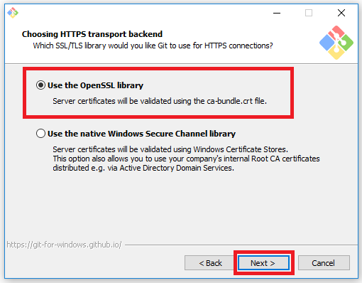
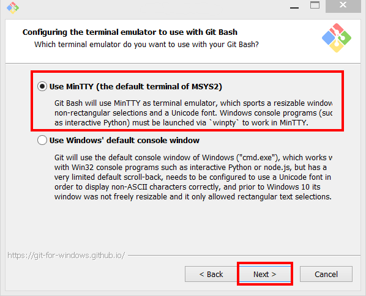

# Prerequisite Install Guide

This guide will walk you through all of the software that needs to be installed and configured in order to contribute to the allReady project.

<!-- START doctoc generated TOC please keep comment here to allow auto update -->
<!-- DON'T EDIT THIS SECTION, INSTEAD RE-RUN doctoc TO UPDATE -->
**Table Of Contents**

- [General Install Steps](#general-install-steps)
  - [MacOSX Installation Instructions](https://github.com/HTBox/allReady/wiki/Running-on-Mac-OS-X)
  - [Windows Showing File Extensions](#windows-showing-file-extensions)
  - [Git](#git)
  - [Configuring Git](#configuring-git)
  - [Node.js](#nodejs)
  - [Proxy Settings](#proxy-settings)
    - [Windows Proxy](#windows-proxy)
    - [NPM proxy](#npm-proxy)
  - [NPM 3](#npm-3)
  - [Bower](#bower)
  - [Gulp](#gulp)
  - [Visual Studio](#visual-studio)
  - [Install .NET Core 2](#install-net-core-2)
  - [Configure Visual Studio External Web Tools](#configure-visual-studio-external-web-tools)
- [Getting the Source Code](#getting-the-source-code)
  - [Forking the Repository](#forking-the-repository)
  - [Cloning the Repository](#cloning-the-repository)
  - [Setup a link to the HTBox/allReady repository](#setup-a-link-to-the-htboxallready-repository)
- [Web Solution](#web-solution)
  - [Open the Solution File](#open-the-solution-file)
  - [Compiling Web Solution](#compiling-web-solution)
  - [Running The Web Site](#running-the-web-site)
- [Running Test Cases](#running-test-cases)
  - [Unit Tests](#unit-tests)
  - [UI Tests](#ui-tests)
- [Mobile Solution](#mobile-solution)
  - [Installing Mobile Tools](#installing-mobile-tools)
    - [Installing Java JDK 8](#installing-java-jdk-8)
    - [Cordova](#cordova)
    - [Ionic Framework](#ionic-framework)
    - [Restoring the Ionic State](#restoring-the-ionic-state)
    - [Visual Studio 2015 Tools For Apache Cordova](#visual-studio-2015-tools-for-apache-cordova)
    - [NPM Task Runner](#npm-task-runner)
  - [Opening Mobile Solution](#opening-mobile-solution)
  - [Compiling Mobile Solution](#compiling-mobile-solution)
  - [Running Mobile application](#running-mobile-application)
    - [Web Browser with Ionic Serve](#web-browser-with-ionic-serve)
    - [In the Visual Studio Emulator for Android](#in-the-visual-studio-emulator-for-android)
    - [On an Android Device](#on-an-android-device)

<!-- END doctoc generated TOC please keep comment here to allow auto update -->

## General Install Steps

### Windows Showing File Extensions

By default Windows is set to not show file extensions for known files which causes files such as .gitconfig and .npmrc to show up as just a period with no file extension.  To fix this we need to set Windows Explorer to show file extensions.

1. Open Windows Explorer
1. Click on the View Tab and select Options

    

Once the "Folder Options" dialog is open: 

1. Click on the View Tab
1. Uncheck the "Hide extensions for known file types"
1. Click Ok

    

### Git

1. Download the latest version of [Git](http://git-scm.com/download).
1. Run the installer. 
1. Click Next 

    

1. Check all except for the last checkbox and click Next

    

1. Select "Use Git from the Windows Command Prompt" and click Next

    

1. Select "Use the OpenSSL library" and click Next

    

1. Select "Checkout Windows-style, commit Unix-style line endings" and Click Next

    

1. Select "Use MinTTY (the default terminal of MSYS2)  

    

1. Check "Enable File system caching" and "Enable Git Credential Manager" then click Install

    

1. After the install has completed run `git --version` in a command prompt or command prompt to verify your install.   As of this writing, latest version is 2.13.1.2

### Configuring Git

There is a little bit of configuration that you need to do git in order for git to work correctly.

>**Note:** the --global is used in the command below to set the default configuration for all repositories.  If it is left off, you need to first clone the repository and then run the command in the allReady folder to save it as just a project configuration.

**User Name to Associate to Changes**  

```
git config --global user.name "Your Name"
```

**Email Address Associated to Github Account**

```
git config --global user.email "youremail@domain.com"
```

**Setup Long Paths (Windows Only)**

```
git config --global --add core.longpaths true
```

**Proxy Servers**

If you are behind a proxy server, you may also need to add the following configurations.

```
git config --global --add http.proxy [Your Proxy Server and Port]

git config --global --add https.proxy [Your Proxy Server and Port]

```

Not always is the git protocol allowed through firewalls.  If you encounter issue with not being able to interact with remote repository you can tell git to always use the https protocol instead.

```
git config --global --add url.https://github.com.insteadof git://github.com
```


You can validate that your configurations were saved by running:

```bash
git config --global --list
```

Your output should look similar to:

```bash
credential.helper=manager
url.https://github.com.insteadof=git://github.com
user.email=youremail@domain.com
user.name=Your Name
core.longpaths=true
https.proxy=[Your Proxy Server and Port]
http.proxy=[Your Proxy Server and Port]
```

Behind the scenes these will commands created entries in the .gitconfig file that is located in
your user profile directory.  On Windows this would be c:\users\\[your idsid]. 

 The file will look similar to:

```text
[credential]
	    helper = manager
[url "https://github.com"]
	    insteadof = git://github.com
[user]
	    email = youremail@domain.com
	    name = Your Name
[core]
	    longpaths = true
[https]
	    proxy = [Your Proxy Server and Port]
[http]
	    proxy = [Your Proxy Server and Port]
```

### Node.js

1.	Download the latest stable version (LTS) of [NodeJS](https://nodejs.org/en/download/) which as of this writing is 6.11.0.

    

1.	Once you download the installer, run it and accept all defaults.
1.	When the install is completed, launch a command prompt and execute `node -v` to validate the version installed.  It should return 6.11.0 as of this writing.

### Proxy Settings

Command line shells do not use global proxy setting so these need to be set in several files. All the files to be edited or created reside in the c:\users\\[your idsid] directory.

#### Windows Proxy 

If you are on a Windows system and will use the Command window to execute Node or Bower commands you need to set your proxies at the user level.

1. In an Windows Command prompt execute the following commands to configure proxies:

```js
setx http_proxy [Your Proxy Server and Port]

setx https_proxy [Your Proxy Server and Port]
```

#### NPM proxy

1.	In a command prompt execute the following commands to configure Node:

```js
npm config set proxy [Your Proxy Server and Port]

npm config set https-proxy [Your Proxy Server and Port]
```

### NPM 3

Launch a command prompt and execute `npm -v` to verify the version installed.  
**If you have followed this install guide and have Npm 3.x or later, you can skip to next section on [Bower](#bower).**

For Windows users, it is suggested that you install npm 3.x to avoid issues with file path lengths.  Npm 3.x works much better on Windows than the 2.x version that came with Node 4.x.  

To upgrade Npm to the 3.x version, we are going to use the Npm package, [npm-windows-upgrade](https://www.npmjs.com/package/npm-windows-upgrade).

First, ensure that you can execute powershell scripts on your system by running the following command from an **elevated PowerShell** by clicking Start, search for PowerShell, right-click PowerShell and select Run as Administrator.

```powershell
Set-ExecutionPolicy Unrestricted -Scope CurrentUser -Force
```

Then, to install and use this upgrader tool, from an an elevated PowerShell or command prompt run: 

```bash
npm install --global --production npm-windows-upgrade
npm-windows-upgrade
```

The tool will show you a list of all the published and available versions of npm (including pre-release and beta versions). Choose the latest 3.x version that shows up, which as of writing this is 3.10.8

To validate that it installed correctly, from your Powershell or command prompt run:

```bash
npm -v
```

You are now done with the elevated Powershell and/or command prompt and can close it.  

### Bower

Open a non-administrative command prompt and execute the command:

```
npm install -g bower
```

You may get a warning message about Bower being deprecated but can ignore the warning.
To verify that Bower was installed, run the command `bower -v`.  As of this writing the version returned was 1.8.0

### Gulp

Open a non-administrative command prompt and execute the command:

```
npm install -g gulp-cli
```

To verify that the gulp-cli was installed, run the command `gulp -v`.  As of this writing the version returned is "CLI version 1.3.0"

### Visual Studio

allReady uses Visual Studio 2017 along with .NET Core 2.0.  This guide will be using the free Visual Studio 2017 Community Edition but any edition of Visual Studio 2017 will work and the steps are the same for all versions.  

***Note**: we recommend using a minimum version number of Visual Studio 15.3.1 to have all the latest tools and facilities.*

1. Download Visual Studio 2017 Community Edition from [https://www.visualstudio.com/downloads/](https://www.visualstudio.com/downloads/)

    

1. Launch the download installer
1. If the "User Account Control" dialog comes up asking if you want to allow this app to make changes to your device, click on the Yes button.

    

1. The bootstrapper will extract files and then may open a prompt with a link the Microsoft Privacy Statement and License Terms.  Click Continue to confirm agreement.

    

1. It may take a few minutes for the Installer page to open.  Here will select components to install.   
Scroll down to "Web & Cloud" section and check the box for "ASP.NET and web development" (highlighted in red).  
"Azure development" tools also can be useful, if you will be deploying apps to Azure. (optional - highlighted in grey)

      

1. Next switch to "Individual Components" tab at top of page.   Then scroll down to "Development Activities" section.  
Check the box for "F# Language Support".

    

1. After you have selected all the components for installation, verify your install location for Visual Studio.  
We are using default location shown highlighted in red at bottom left.  
Next click on Install at bottom right. 

       

1. Installation will begin and will take awhile to complete depending on connection speed as it has to download the different components.

    

1. After installation is complete, launch Visual Studio.   Can then optionally sign in to your account to use your prior settings or sign up for an account and make settings and theme selections.

_Note: You can add or remove components from your Visual Studio Installation anytime.  Type "Visual Studio Installer' from the Start Menu to run._

### Install .NET Core 2 SDK

allReady is currently using .NET Core 2 as a way to be future-proof but more importantly to enable any developer to contribute to the project. Independent on OS that a developer has choosen.
(in this guide, the screenshots and examples will show Windows)

To install the .NET Core 2 SDK, download the appropriate installer for your OS from [https://www.microsoft.com/net/download/core](https://www.microsoft.com/net/download/core)


Launch the installer and follow the steps given. There's no extra settings that need to be done.

**Important:** Before you can build the allReady project, you have to close Visual Studio for it to be able to find the recently installed SDK.

> There's been some reported instances where after installing the .NET Core 2 SDK the project would not show the webpage, even though building the project works. This requires a computer reboot to resolve the issue.

### Configure Visual Studio External Web Tools

We now need to tell Visual Studio to put our PATH environment variable higher in the order of paths that are used to call external web tools.

1. Open Visual Studio
1. Click on the Tools Menu and Select Options

    

1. Expand the "Projects and Solutions" section, then expand "Web Package Management" and select the "External Web Tools".  In the list of "Locations of external tools:" click on the $(PATH), click the Up arrow in top right corner until $(PATH) is at the top and click the OK button 

    

1. Select Tools for Apache Cordova

1. Uncheck "Use a sandboxed version of NodeJs"

    

You have now finished installing all of the required software to start working on the Web Solution.  

> Even if you are only planning on working on the mobile application, the API that the mobile application uses is part of the Web Solution so you will want to make sure that you can compile and run the web solution.  

## Getting the Source Code

### Video: Forking and Cloning from GitHub
[](https://www.youtube.com/watch?v=OODDLyvePr8)

### Forking the Repository

In order to make changes the first thing you need to do is create a copy of the repository into your account.  In Git terms, this is called forking the repository.

The reason that you need to fork the repository is because you do not have write access to the HTBox allReady repository.  When you fork the repository into your account, you have full write access to it to make changes and then you can send them back to the HTBox allReady repository by submitting a pull request.

**Steps to Fork the Repository:**  

1. Navigate to [https://github.com/HTBox/allReady](https://github.com/HTBox/allReady)
1. Click on the Fork button

    

1. After the fork has been made, you will be redirect over to the fork.  Your repository will be https:<i></i>//github.com/**[Your User Name]**/allReady

You are now ready to download the repository onto your machine by cloning it.

### Cloning the Repository

Cloning the repository is how you get the repository from Github onto your local machine and keep the link to Github to be able to interact with the repository local.

You will want to make sure to do a clone and not download the zip file version of the repository if you want to be able to interact with the source code on your machine as a Git repository.

**Steps to Clone:**

1. Navigate to your forked copy of the repository.
1. Click on the "Clone or download" button
1. In the popup that comes up, click on the Clipboard looking button next to the url.

    

1. Next you need to open up a terminal / command prompt
1. In the command prompt, navigate to where you want to store your source code at.  
1. Then run the following command to create an allReady directory and download the repository onto your machine.  Make sure to replace "[Your UserName]" with your actual Github user name.

        git clone http://github.com/[Your UserName]/allReady

You now have the repository on your machine.  

There are 2 Visual Studio solutions in the allReady\AllReadyApp directory.  

1. AllReadyWebonly.sln -> This file will open just the web project files and does not include the mobile application.  Use this solution if you are not going to be working on the mobile application. 
1. AllReadyApp.sln -> This file will open all of the allReady projects including the mobile application.  Use this file if you are going to be working on the mobile application.

The first time that you open up the solution in Visual Studio, it will install the npm and Bower dependencies.  This can take several minutes depending on your internet connection.  Once all of the npm and Bower dependencies have been installed, you need to build the solution.  Building the solution the first time will download all of the nuget packages.  

If you are building the mobile application it will take several minutes to download additional dependencies that Visual Studio needs.  

Once the solution compiles successfully you are ready to start contributing.

### Setup a link to the HTBox/allReady repository

Before making changes to your repository, you will want to setup a reference back to the HTBox allReady repository so that you can pull changes into your forked repository.

1. Open the command prompt and navigate to the allReady directory.
1. Run the following command to setup a reference called upstream to the HTBox/allReady repository.

        git remote add upstream https://github.com/HTBox/allReady.git

1. Verify that it was setup successfully by running 

        git remote -v         
        
    

Now that we have the code we are ready to make sure that it compiles and that you can run the unit tests.

## Web Solution

The web solution contains the web site along with all of the unit tests.  

> Note: The web solution does not contain the mobile application.

### Open the Solution File

In the allReadyApp directory are 2 solution files.  You will want to open the **AllReadyWebOnly.sln**


1. Double-click on the "AllReadyWebOnly.sln" file in Windows Explorer
1. If you are prompted to say how you want to open the sln file, click the More apps.  Scroll down until you see Visual Studio 2017.  Can optionally check box to "Always use this app to open .sln files" and click Ok

    

1. The first time that you open the solution is will restore the package dependencies for the unit test and web projects.

    
    
    

    

1. Once the package dependencies restore is completed, the Task Runner Explorer will popup and start the Gulp watch task.

    

### Compiling Web Solution

Now that the package dependencies are restored you are ready to build the solution.


The first time that you compile the solution all of the nuget packages will be restored.


It may take a few minutes to compile the solution the first time.  

If all has went well your solution compiled successfully and you are ready to run the web site.

### Running The Web Site

By default the Web project is set as the Startup Project.  You can verify this in Solution Explorer by looking at the Web\AllReady project and seeing that it is bolded.


If the project is not set as the startup project, right-click on it and select "Set as Startup Project"


Once the startup project is set you are ready to start debugging the project.  There are 3 ways to start up the project:

1. Press F5
1. Click on the IIS Express button on the toolbar

    

1. Go under the Debug menu and select "Start Debugging"    

    

1. If everything worked you should now be looking at a view of the website in your default browser.

    

1. There are 2 accounts already created for you to log in with to test out different functionality.  You can get the account information at [https://github.com/HTBox/allReady/wiki/Solution-architecture#run-and-test-locally](https://github.com/HTBox/allReady/wiki/Solution-architecture#run-and-test-locally)


## Running Test Cases

### Unit Tests

We need to verify that you can run the unit test.  allReady has over 1,000 unit test.  The expectation is that as you add functionality there is a unit test that accompanies it.  You should also run all of the unit test before submitting any pull arequest.

The unit test project is in the Test folder and called AllReady.UnitTest.  


To run the test you will use the Visual Studio Test Explorer.  

1. Open the Visual Studio Test Explorer under Test -> Windows -> Test Explorer menu.

    

1. Once the Test Explorer is open you can either click the Run All to execute all of the tests.  Note that it may take a few minutes for all of the test to show up in the list of tests.

    

1. When the test are executing it will show a progress bar at the top, change the "Run All" link to a Cancel link and as a test completes, is skipped or fails, it will show up in the different categories.

    

1. Once all of the test have been run the progress bar will be a solid color to indicate the status. The "Run All" link will also be available again.   
    * Green = All Run successfully
    * Orange = At least 1 test was skipped
    * Red = At least 1 test failed

    

1. If any of the tests fail, you will need to work to make the test pass.   

### UI Tests

There is also a suite of UI test in the  Test\AllReady.ScenarioTest project.  The test use  [Canopy](http://lefthandedgoat.github.io/canopy/index.html) which is an F# library that makes it easier to work with the Selenium Web Driver to automated web site UI tests.   

> In order to run the Canopy test, you need to have Chrome installed.  You can download Chrome at [https://www.google.com/chrome/browser/desktop/index.html](https://www.google.com/chrome/browser/desktop/index.html)

As you make UI changes, it would be very helpful to create a UI test for those changes.  

The AllReady.ScenarioTest project is a console application.  You can either run it within Visual Studio or from the command line.  The instructions below are going to show how to run the tests from within Visual Studio.  


To run the UI test, you first need to start up the web site.

1.  The canopy tests require that the web site is running.  Make sure that the  Web\AllReady project is the start up project.  Press F5 to start the web site in debug mode or Ctrl+F5 to start without debug mode.
1. Before we run the test we need to set a breakpoint to prevent the console application for the canopy tests from automatically exiting.  Open the Program.fs file and set the breakpoint on the `quit()` statement like below.

    

1. Now that the web site is running and breakpoint is set, we are ready to run our UI test.  In Visual Studio solution explorer, right-click on the AllReady.ScenarioTest project, select the Debug menu, and click on "Start New Instance"

    

1. This will build the project, launch Chrome, and run the automated test.  It will take a few minutes for the test suite to run.  You will see the Chrome browser that was open being automatically interacted with by the Canopy test. 
    * If there are no error, the console application will exit and the chrome browser that it opened will close. 
    * If any errors occurred, it will stop at the line in Visual Studio.  If you get a time out error, this typically means that either the test was not able to navigate to the page it expected to be on or the element it was looking for was not able to be found.   


You are now ready to start working on the allReady web site and unit test.  Please read through the [Git guide](../git/gitprocess.md) for the process of contributing to the allReady repository.

> **If you are planning on working on the mobile application, continue with the rest of this guide.**
 
## Mobile Solution

> **NOTE The Mobile App is in process of being updated to Visual Studio 2017**

###  Installing Mobile Tools

This section will guide you through installing all of the software and configurations that are needed to get the mobile application up and running.

>**Make sure that you have followed all of the steps above to get all of the software installed/configuration and the web application running.  The mobile solution uses the API that is part of the Web solution**

The mobile application uses the [Ionic framework] (http://ionicframework.com) version 1 which is built on top of Angular v1, Html 5, Css3, JavaScript, and Cordova.  The backend for the mobile application is the WebAPI endpoints that are part of the web solution.  

#### Installing Java JDK 8

The Java JDK 8 is required to compile the mobile solution for the Android platform.  We are install this outside of the Visual Studio installer because currently the Visual Studio 2015 installer installs an older version of JDK 7 and Google has moved the Android platform to JDK8.

1. Download JDK 8 from [http://www.oracle.com/technetwork/java/javase/downloads/jdk8-downloads-2133151.html](http://www.oracle.com/technetwork/java/javase/downloads/jdk8-downloads-2133151.html)

1. You need to accept the license agreement before you can download

    

1. After you accept the license agreement you can then download the Windows x64 version.

    

1. If the User Account Prompt comes up, click on the Yes button

    

1. On the 1st screen, click next

    

1. Leave all of the default options selected and click Next  

    

1. It will take a few minutes to get the install ready and then it will popup the next screen to input the destination folder

    

1. The install will prompt for the destination folder.  Leave at the default and click Next.  

    

1. It will take a few minutes for the install to completed.  Once the install is completed click the Close button 

    

Once the install is completed we need to set the JAVA_HOME environment variable

1.  Go under the Start Menu and type in "edit the system environment" and select the "Edit the system environment variables" control panel option. 

    

1. Press the Environment Variables button 

    

1. Under the System Variables click on the New... button

    

1. For the Variable name: enter JAVA_HOME and click the Browser Directory... button
    
    

1. Navigate to C:\Program Files\Java, select the JDK8 version that you just installed and click the Ok button

    

1.  To save the JAVA_HOME environment variable, click the Ok button
    
    
1. Click the Ok button to close the Environment Variable editor

    

If you are behind a proxy server you need to add your proxy configuration to Java.

1. Under the Start Menu search for Java and select Configure Java

    

1. Click on Network Settings... button

    

1. Click on the Advanced... button

    

1. Enter you proxy server for Http and Secure (https), the ports for them, and addresses to skip for proxy (suggest 127.0.0.1;*.yourdomain.com).  Make sure to replace *.yourdomain.com with your network domain.

    

#### Cordova 

The next thing that we need to do is to get the Cordova tooling installed.  We are going to install this outside of the Visual Studio install so that all of the Ionic framework commands are available to use since many of them require the Cordova tooling be installed globally.

1. Open a command prompt and run:

        npm install -g cordova

1. Verify the Cordova install by getting the version installed.  As of this writing it returned 6.3.1.

        cordova -v

    > You need to answer the prompt "May Cordova anonymous report usage statistics to improve the tool over time?   

#### Ionic Framework

Next we need to install the Ionic Framework command line interface.  The Ionic CLI allows us to easily add Cordova plugins, add new mobile platforms, compile the Android APK, plus many more useful features.  

1. Open a command prompt and run:

        npm install -g ionic

1. Verify the Ionic install by getting the version installed.  As of this writing it returned 2.1.0

        ionic -v

#### Restoring the Ionic State

After the tooling for both Cordova and Ionic is installed, we need to restore the ionic state.  This will install the configured Cordova platforms and plugins.

1. Open a command prompt 
1. Navigate to the allReady\allReadyApp\Mobile-App directory
1. Run the following command to restore the platforms and plugins

        ionic state restore

#### Visual Studio 2015 Tools For Apache Cordova

The last bit of software that we need to install is the Visual Studio 2015 Tools for Apache Cordova.  This tooling provide a very useful Android emulator, allows you to build and deploy to Android devices or emulators directly from Visual Studio, and to debug the application from within Visual Studio.

If you are behind a proxy server, you need to create a configuration file to tell the Android SDK what the proxy server is.

1. BEFORE installing Visual Studio Tools for Apache Cordova create a file at: **%USERPROFILE%\\.android\androidtool.cfg**
1. In the androidtool.cfg file that you just created, place the following contents.  Make sure update **"http.proxyPort"** and **"http.proxyHost"** in the file

        ### Settings for Android Tool
        http.proxyPort=8888
        sdkman.enable.previews=false
        http.proxyHost=127.0.0.1
        sdkman.ask.adb.restart=false
        sdkman.show.update.only=true
        sdkman.force.http=false
        sdkman.use.dl.cache=true

1.  Now you are ready to install the Visual Studio Tools for Apache Cordova


To install the Tools for Apache Cordova, we need to add additional features to the already installed Visual Studio 2015 Community Edition. 

1. Open the Start Menu and type "Programs and Features"

    

1. In the search box enter Visual Studio 2015, select Microsoft Visual Studio Community 2015 with  Updates, click the Change option

    

1.  This will open up the Visual Studio 2015 install.  It will take a few minutes for it to pull down the configuration feed

    

1. Click the modify button to change the options that Visual Studio 2015 has installed.

    

1. Expand the Cross Platform Mobile Development Section and Select "Html/Javascript (Apache Cordova) Update 10" option

    

1. When you check the "Html/Javascript (Apache Cordova) Update 10" option it will also check the "Windows and Web Development\Windows 8.1 and Windows Phone 8.0/8.1 Tools" which the allReady mobile solution does not target.  Unless you are already doing "Windows 8.1 and Windows Phone 8.0/8.1" development you can uncheck this option and save yourself about 8 gigs worth of disk space.

    

1. Click the Next Button

    

1.  Verify that everything is selected and click the Update button

    

1. If prompt with a User Account Control dialog, click Yes to let the install proceed

    

1. It will take a bit for all of the software to install as it is ~7 gigs of software that it has to download

    

1. Once the install is completed, you may be asked to restart.  When you are ready to restart the computer click on the restart button

    
    
1. You will also need to add the Android SDK tools directories to your system path environment variable.  Open the Environment Variables dialog, find and click PATH under the System Variables section and click Edit...

    
    
1. In the Edit environment variable dialog, click the New button to add a new entry to the list of path values.  In the new box that appears after the last existing entry, type **C:\Program Files (x86)\android\android-sdk\tools** and hit Enter.  

    
    
   Repeat this step to also add **C:\Program Files (x86)\android\android-sdk\platform-tools** to the path.  Once done, click OK.  Click OK in the Environment Variables dialog to save the changes.

#### NPM Task Runner

The Mobile Application has npm task setup for ionic serve and in order to run those from within Visual Studio you need to install the NPM task runner extension.

1. Open Visual Studio
1. Go under Tools Menu and select Extensions and Updates

    

1. Once the dialog opens for Extensions and Updates

    1. Click On the Visual Studio Gallery Section
    1. Click on the Search box and enter npm
    1. Find the "NPM Task Runner" and click the Download button

        

1. Once the download is completed it will automatically start the installer and ask you to click the install button
    
    

1. Once the install is completed, it will ask you to restart Visual Studio for it to take effect.

        


### Opening Mobile Solution

In the allReadyApp directory are 2 solution files.  You will want to open the **AllReadyApp.sln**

1. Double-click on the "AllReadyApp.sln" file in Windows Explorer to open it in Visual Studio 2015

    

1. The first time that you open the solution is will restore the package dependencies for the unit test and web projects.

        


### Compiling Mobile Solution

Now that the npm and Bower package dependencies are restored you are ready to build the solution.


The first time that you compile the mobile solution it will take several minutes as it has to download the vs-tac npm package. 

If all has went well your solution compiled successfully and you are ready to run the mobile application.

### Running Mobile application

There are 4 ways to run the mobile application:

1. In a Web Browser using Ionic command line
    * This is useful for testing outside of Visual Studio.  You can also get a view of iOS and Android side-by-side which is helpful.
1. In a Web Browser using Ripple  
    * This is useful for using Visual Studio to do debugging
1. In the Visual Studio Android Emulator.  
    * This is useful for testing what it should work like on an actual device.
1. On an Android Device
    * This is useful before you deploy to the app store to make sure that everything works as expect on a real device.     

#### Web Browser with Ionic Serve

We can do most of our mobile testing in the web browser.  However, anything that uses a Cordova plugins will not working in the web browser.  

To test in the browser we will be using the ionic serve command which compile the sass file, starts up a node based web server with livereload, and launches your default web browser (Chrome is suggested).

To run the ionic serve we will be using the Visual Studio NPM Task Runner extension that we installed earlier.  There are 2 npm commands that have been added to the package.json file for the AppReadyApp to launch the ionic serve process:

1. ionic-serve -> starts up the server, open the default browser and navigates to the mobile app view. You can still get to the ionic-lab page that ionic-lab launches.
1. ionic-lab -> same as the ionic serve but the start up page is the ionic-lab page that shows a side by side view of Android and iOS.

Before launching the ionic npm task, we need to have the web site running in order to access the allReady Api. 

1. Set the Web\AllReady project as the start up project by right clicking on the Web\AllReady project and selecting "Set as Startup Project"

    

1. Once the startup project is set you are ready to start debugging the project.  There are 3 ways to start up the project:

1. Press F5
1. Click on the IIS Express button on the toolbar

    

1. Go under the Debug menu and select "Start Debugging"    

    

1.  Once the Web Site is started we can launch the npm ionic task by right clicking on the task that you want to start and selecting run

    

1. The task runner explorer will open up a new tab and run the task that you selected. In the screenshot below, the ionic-serve task is running

    

    * The ionic-serve will open up your default web browser to http<i></i>://localhost:8100.  If you want to get the lab page, add ionic-lab to your url.

        

    * The ionic-lab will open up your default web browser to http<i></i>://localhost:8100/ionic-lab

        

Now you can use the Chrome Developer Tools to doing any element inspecting or JavaScript debugging. As you make changes, the ionic serve has livereloading built-in and it will automatically refresh you web browser. 


#### In the Visual Studio Emulator for Android

Using the Visual Studio Android Emulator requires the Windows Hyper-V featue to be enabled.

By default when you install the Visual Studio Tooling for Apache Cordova, it downloads 2 devices for the Visual Studio Emulator for Android: 7" KitKat(4.4) XHDPI Tablet and 5" KitKat(4.4) XXHDPI Phone.  


> If you want to download additional devices, open up the Visual Studio Emulator for Android, find the device that you want to download and click on the  icon for the device you want.  Once you download a device it will automatically become available as a target in Visual Studio for the AllReadyApp project.


**WARNING:** With the default configuration of the Mobile App, you will not be able to communicate with the Api since it uses the web site running locally on your running using localhost which is not available to external devices or emulators.  To get around this you need to make sure that any Api changes you have made have have been submitted as a Pull Request and merged into the AllReady master branch.  

Changing the Api Url requires a coding change.

1. In the AppReadyApp project, open the www\services\backend.service.js file
1. Change the protocol from http:// to https://
1. Change the domainUrl variable from localhost:48408 to allready-d.azurewebsites.net
1. Save the file

To build and deploy the Mobile Application to the Visual Studio Emulator for Android you need to set the Mobile\AllReadyApp project to the startup project by bight clicking on the AllReadyApp project and selecting "Set as StartUp Project"


Next you need to set the target for the project to the device that you want to deploy to by click on the target drop down.


Now you are ready to deploy to the Visual Studio Emulator for Android using 1 of 3 ways:

1. Press F5
1. Clicking on the Emulator that you selected in the target list
1. Go under the Debug menu and select Start Debugging

The virtual machine for the selected emulator will start, Visual Studio will build the mobile application and then deploy it to the emulator.

> This first time that you deploy to either an emulator or an Android device the android sdk will download Gradle.  This may take a few minutes.

The first time that you launch a Visual Studio Emulator for Android device it will take a few minutes to set it up and launch.  You may be ask a few question about networking.

1. The emulator needs to be able to connect to the internet in order to talk with the allReady Api.  If you are prompted to configure the emulator to connect to the Internet, click Yes.

    

1. If you are not running Visual Studio as an administrator you will be you will prompted to retry the configuration as an Administrator 

    

1. If the User Account Control comes up for the Windows Phone Packages, click Yes

    

1. The emulator will then take a few more minutes and then you will be presented with the Android OS.  Click Ok on the initial screen.

     

#### On an Android Device 

> **Important:** You must be able to access the Android device on Windows in order for this to work.  It is outside of this guide to troubleshoot Windows not seeing your Android device.

**WARNING:** With the default configuration of the Mobile App, you will not be able to communicate with the Api since it uses the web site running locally on your running using localhost which is not available to external devices or emulators. To get around this you need to make sure that any Api changes you have made have been submitted as a Pull Request and merged into the AllReady master branch.  

Changing the Api Url requires a coding change.

1. In the AppReadyApp project, open the www\services\backend.service.js file
1. Change the protocol from http:// to https://
1. Change the domainUrl variable from localhost:48408 to allready-d.azurewebsites.net
1. Save the file

To build and deploy the Mobile Application to your Android device you need to set the Mobile\AllReadyApp project to the startup project by bight clicking on the AllReadyApp project and selecting "Set as StartUp Project"


The last thing is to set the Target for the project to the device that you want to deploy to by click on the target drop down.


Now you are ready to deploy to your Android device from Visual Studio using 1 of 3 ways:

1. Press F5
1. Clicking on the Device that you selected in the target list
1. Go under the Debug menu and select Start Debugging

Visual Studio will then build the mobile application and deploy it to your device.

> This first time that you deploy to either an Android device or the emulator the android sdk will download Gradle.  This may take a few minutes.
